# 🍔 Full Stack Restaurant Ordering App

A full-stack food ordering web application built with Next.js.  
This project simulates a real-world restaurant ordering system with authentication, cart management, payments, and admin controls.

---

## 🚀 Live Demo

---

## 📸 Screenshots

### Home Page
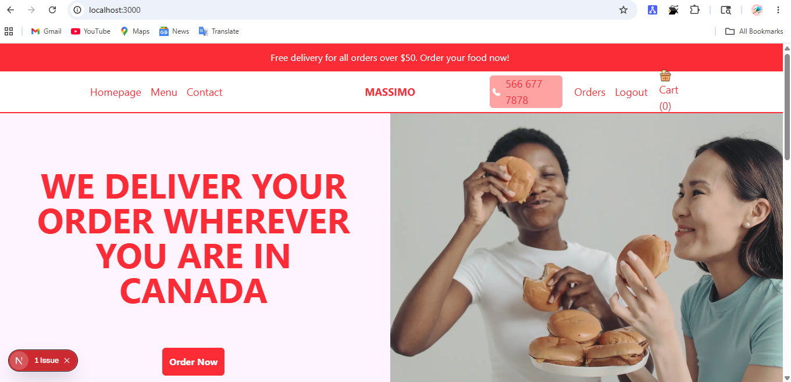 
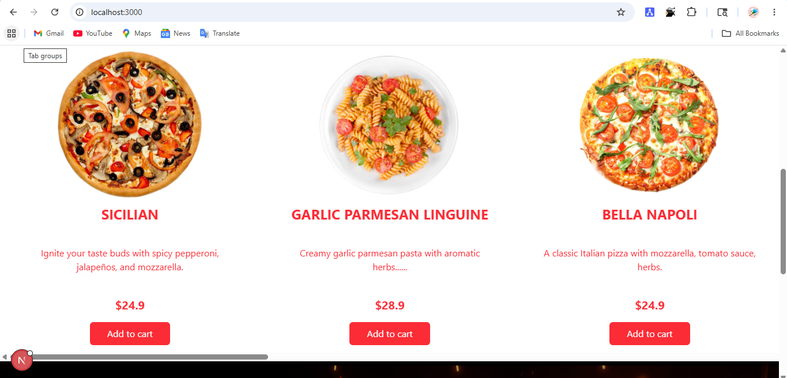 
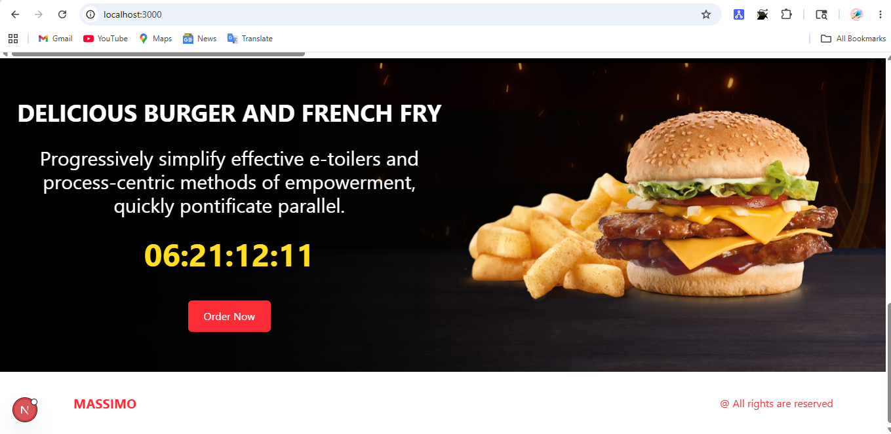 

### Menu Page
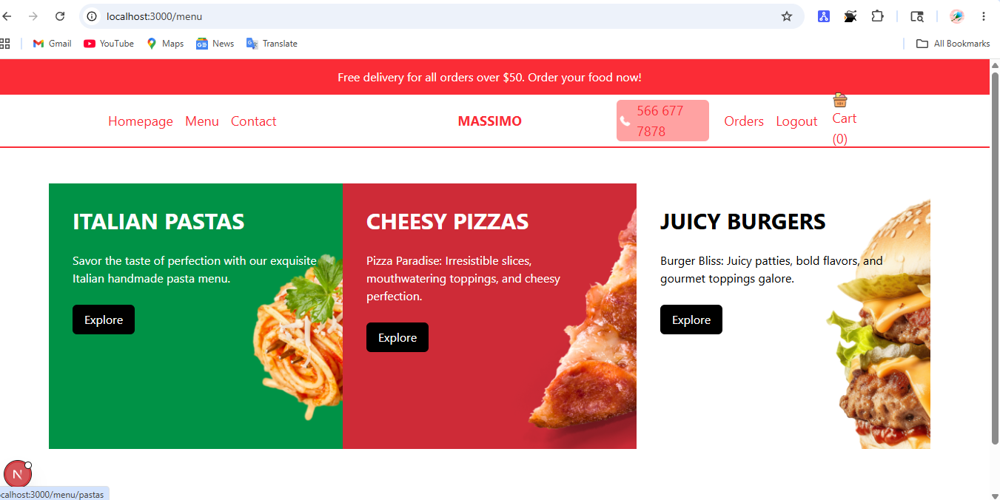
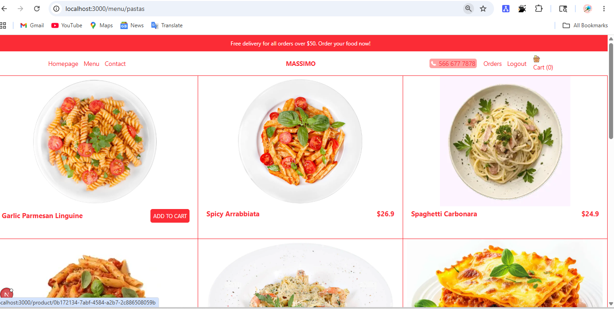
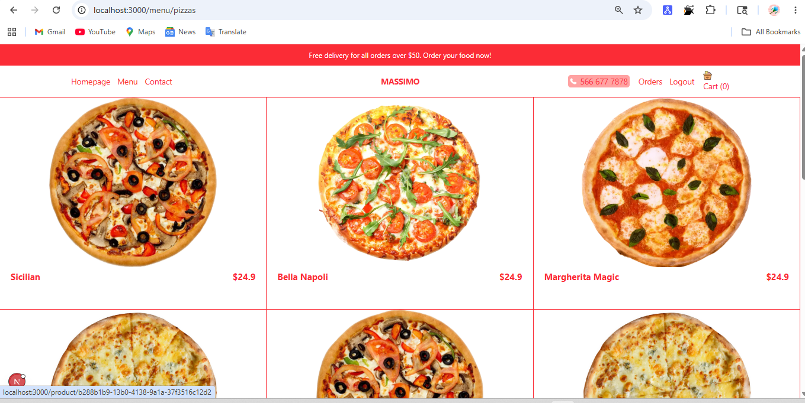
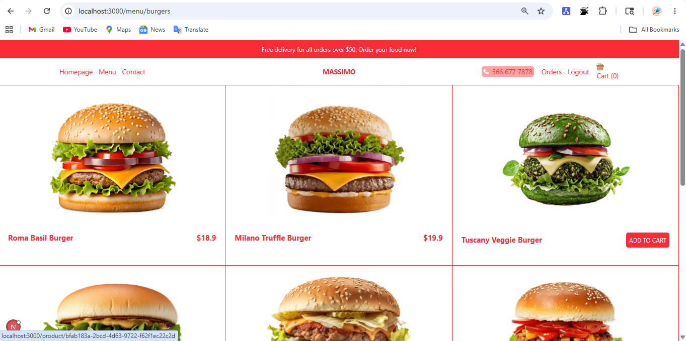
### Cart Page
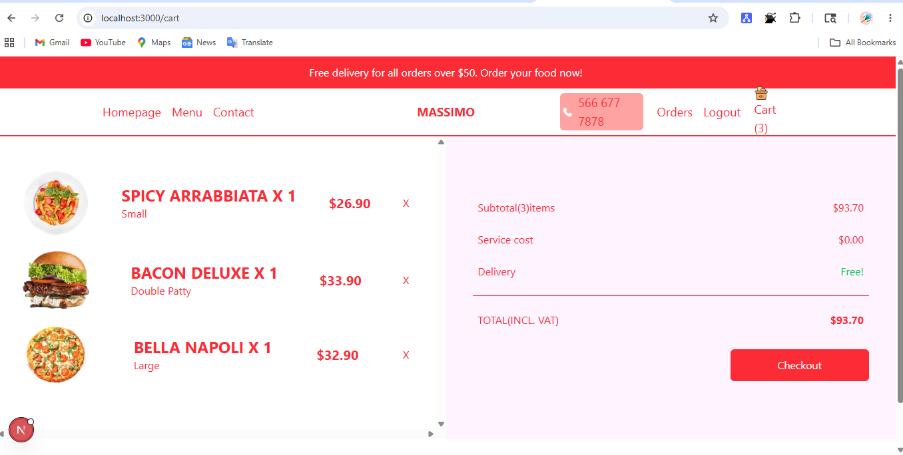

### Order Status
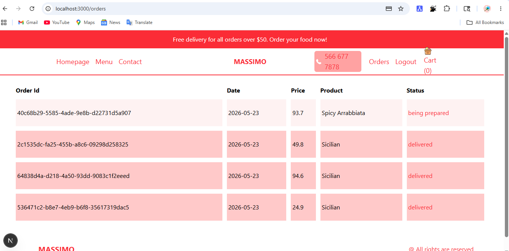

### Payment Page
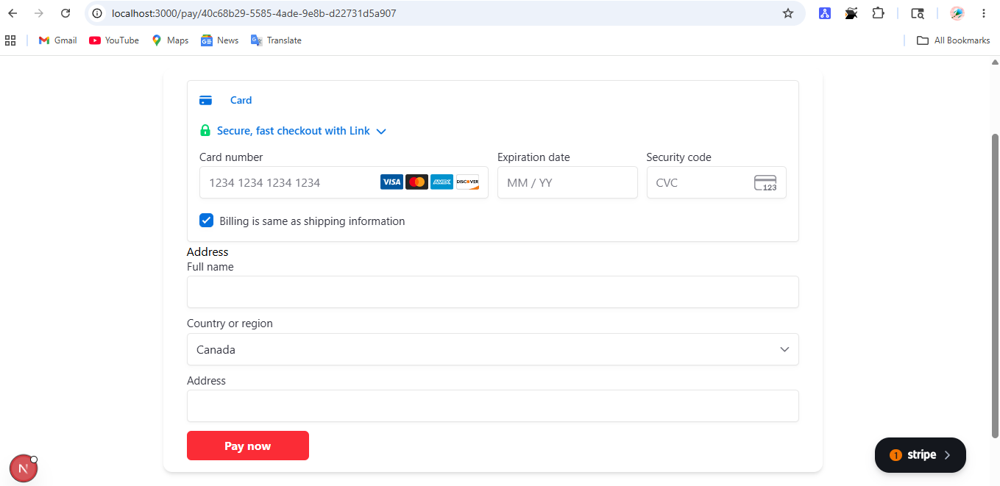

### Payment Success
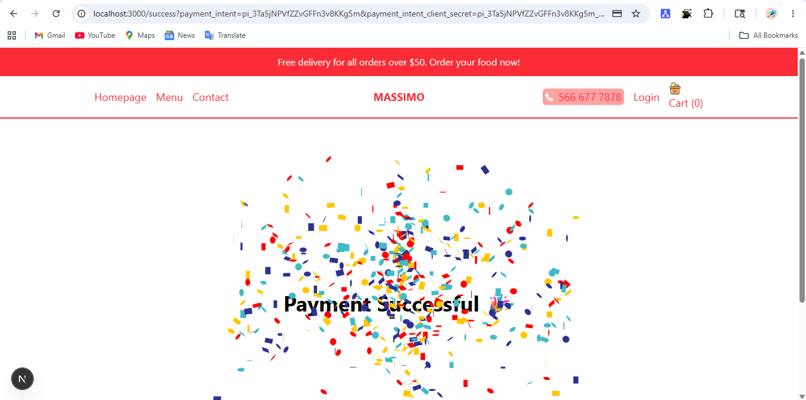

---

## ✨ Features

- User authentication (NextAuth)
- Browse food categories (Pizza, Burgers, Pasta, etc.)
- Add/remove items from cart
- Dynamic product pages
- Order tracking system
- Admin panel for updating order status
- Stripe payment integration (test mode)
- Cloudinary image uploads
- Responsive UI for all devices

---

## 🛠️ Tech Stack

- Next.js (App Router)
- React.js
- TypeScript
- Tailwind CSS
- Prisma ORM
- PostgreSQL
- NextAuth.js
- Stripe API
- Cloudinary

---

## 🧠 What I Learned

This project helped me understand:

- Full-stack architecture using Next.js
- API routes and server-side logic
- Authentication flow with NextAuth
- Database modeling using Prisma
- Payment integration using Stripe
- Image upload handling with Cloudinary
- State management and UI optimization
- Real-world deployment workflow

---

## 📂 Project Structure
